### `afsal@github ~ $ whoami`

<table>
  <tr>
    <td valign="top"></td>
    <td valign="top"></td>
  </tr>
</table>

### `afsal@github ~ $ ./contributions.sh`

### `afsal@github ~ $ ./about.sh`

Building modern, secure, and scalable web applications from development to deployment.

