<h3><code>afsal@github ~ $ whoami</code></h3>

<table>
  <tr>
    <td valign="top"></td>
    <td valign="top"></td>
  </tr>
</table>

<h3><code>afsal@github ~ $ ./languages.sh</code></h3>

<h3><code>afsal@github ~ $ ./projects.sh</code></h3>

<h3><code>afsal@github ~ $ ./about.sh</code></h3>

Building modern, secure, and scalable web applications from development to deployment.

<h3><code>afsal@github ~ $ ./connect.sh</code></h3>

